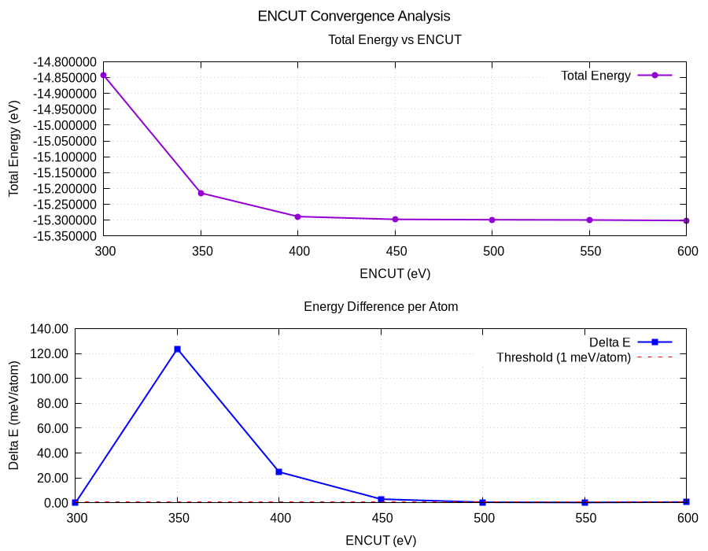

# ENCUT Convergence Test Guide



### 1. Prerequisites
Ensure the following VASP input files are in your working directory:
* `POSCAR`, `KPOINTS`, `POTCAR`, `INCAR`

### 2. Configurations

Modify `run_encut.sh` to match your desired `ENCUT` list and `VASP_CMD`:

```bash
# ==================== CONFIGURATION ====================
ENCUT_LIST="300 350 400 450 500 550 600"
VASP_CMD="srun /bin/vasp_std_5.4.1"
```

### 3. Execution
Run the automated script to test various cutoff energy values:

```bash
./run_encut.sh
````

Alternatively, you can submit it as a cluster/supercomputer job using a Slurm submission script:

For example:
````
#!/bin/bash
#SBATCH -J vasp
#SBATCH -p qM                     # Job class
#SBATCH -n 128                    # Number of MPI processes
#SBATCH -c 1                      # Number of threads per MPI process
#SBATCH -o slurm-%j.out           # Standard Output file
#SBATCH -e slurm-%j.err           # Standard Error file
#SBATCH -t 47:30:00               # Time limit

module load inteloneapi/2023.2.0
module load intel-mpi/2021.16

date
sh run_encut.sh > output.log 2>&1
date
````

This will automatically loop through the `ENCUT` list, run VASP for each value, save individual `OUTCAR.<encut>` files, calculate ΔE (meV/atom), and generate an `encut_convergence.dat` file.

### 3. Visualization

Generate and check the convergence plot (`encut_convergence.png`):

```bash
gnuplot plot_encut.gnu
```

Tip: Look for the energy difference to drop below the **1 meV/atom** red threshold line to determine the optimal `ENCUT`.